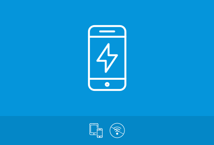
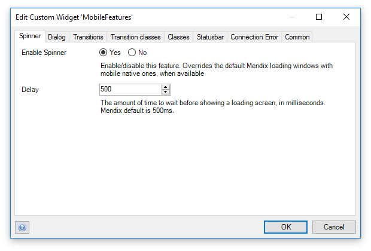
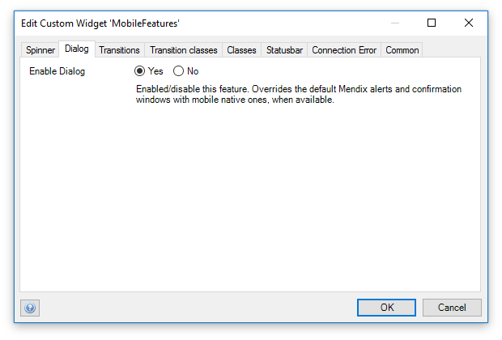
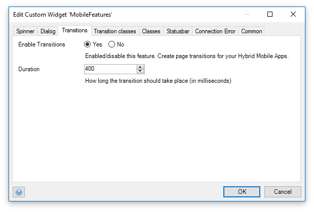
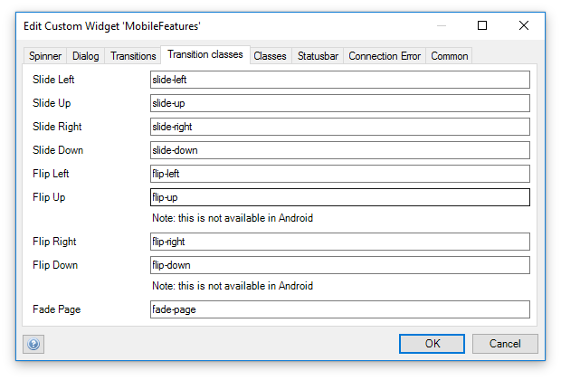
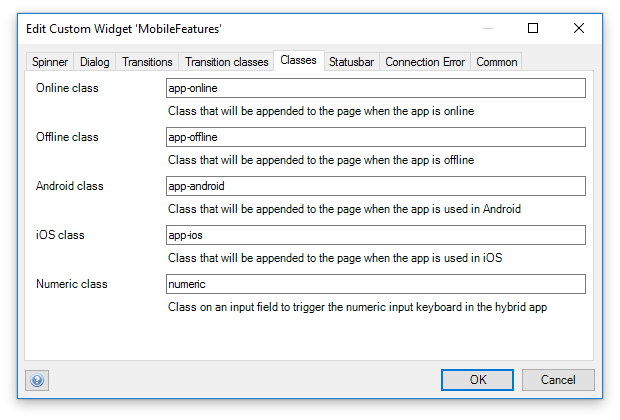
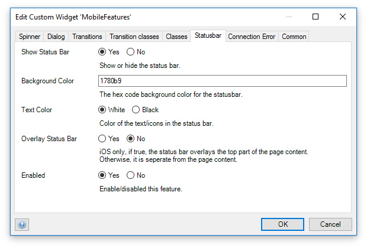

# Mobile Features Widget



Mobile Features widget can be placed in a page layout and used in mobile hybrid applications. This widget is heavily based on [MobileNativeFeatures](https://github.com/tieniber/MobileNativeFeatures) from [Eric Tieniber](https://github.com/tieniber). The difference with this widget is that it packs multiple features in one single widget.

## Features

This widget includes the following features that can be used in a Mendix mobile hybrid application
- Transitions: transition between pages using transitions
- Numeric input: Set an input field to numeric, triggers numeric keyboard on mobile devices
- Dialog: info, warning, and error messages will be shown using native dialog boxes
- Spinner: instead of the Mendix default loading dots, use the native loading spinners for your device
- Statusbar: set the text color and background of the status bar (i.e, the bar with time and other settings)
- ~~Custom Connection Error: Show a bar on top of the window when a connection error occurs (instead of a normal warning dialog)~~ (Work in progress)
- Custom body classes:
    - online/offline: When the app goes offline, it will add a configurable class to the body of the page
    - android/ios: Depending on the platform, it will add a configurable class to the body of the page (used for styling per platform)

Tested on Mendix version: `7.0.2`, should work in Mendix 6 as well

## Typical usage scenario

The widget is designed to be dropped on your master mobile page template. It overrides functions in the Mendix UI code to hook into Cordova plugins. The features above (with the exception of body classes) can be switched on/off.

## Dependencies

Be sure that these Cordova plugins are included in your PhoneGap config.xml file. Without these, some features will not work:

### Transitions
```xml
    <gap:plugin name="com.telerik.plugins.nativepagetransitions" source="npm" />
    <!-- This needs to be added to make sure the cordova-plugin-crosswalk-webview animates correctly -->
    <preference name="CrosswalkAnimatable" value="true" />
```

### Dialog
```xml
    <gap:plugin name="cordova-plugin-dialogs" source="npm" version="1.2.1" />
```

### Spinner
```xml
    <gap:plugin name="cordova-plugin-spinner" source="npm" />
```

### Statusbar
```xml
    <gap:plugin name="cordova-plugin-statusbar" source="npm" version="2.1.3" />
```

### Configuration

#### Spinner

This feature will override the normal Mendix spinner (loading dots) with a native mobile one.



#### Dialog

This feature will override the normal Mendix dialog with a native mobile one.



#### Transitions



#### Transition classes



#### Classes



#### Statusbar



### Connection Error

This feature is planned for the future. Right now it is not stable and disabled.

### Advanced

**Note: (1) These are all experimental options and might break in future Mendix versions. Please switch them off if it causes any problems (and create an issue here)**

- **List view lazy load** (1)

When this feature is turned on the list view will render the items after the page is loaded which can greatly increase the user experience.

- **Group box lazy load** (1)

When this feature is turned on the group box will render the items after the page is loaded which can greatly increase the user experience. You can add the `lazy` class to the groupbox to remove the spacing and borders.

- **Set transition**

The transitions used in the tab 'Transition classes' are usually set **before navigating** a page. This works fine in an online app. In Offline mode, the transition should be set on a **view change**. Set it to this option if you experience problems with the transitions (titles showing up before you transition).

- **On pause timeout**

Only change this setting when needed. When pausing the app (suspend, without quitting) transitions should be cancelled to prevent unwanted behavior in older Android versions (we can't reproduce this on Android 7, but have seen it on Android 5). We set a timeout (in ms) to cancel the transition after the app is paused.

- **Disable on logout**

The widget might run into problems with the spinner when the login page does not have a layout with the MobileFeatures widget. This option makes sure the widget is completely disabled on logout. If you do use this widget in the layout that is part of the login page, you can switch this off.
